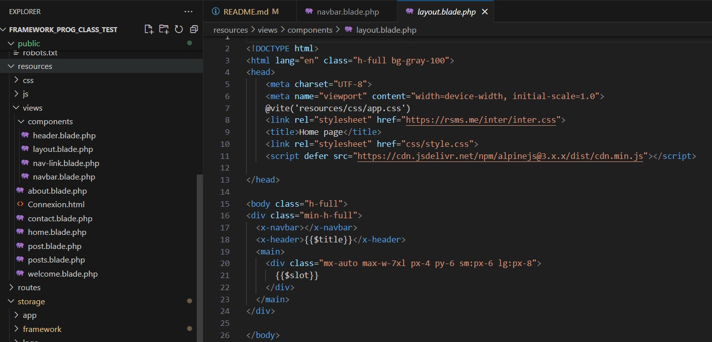

# Laravel Project of Victor LEQUEUX AUDRAN

<p align="center"><a href="https://laravel.com" target="_blank"></a></p>

Welcome to the Github repository of the Laravel project of Victor Lequeux Audran done for the course Framework Based Programmming at ITS !

## Use of Tailwind template and Blade component

In order to have a functional and clear Website, I used the PHP code of free pages templates in my views from the website Tailwind.

<p align="center">
    
</p>

And to avoid redundancy between my pages I used Blade Components to factorize my code for common elements like the navigation bar and the header   

<p align="center">
    
</p>

## Database 

My database is handled by Table plus and is using SQLite.

<p align="center">
    
    
</p>

To interact with  my database I am using Eloquent ORM models.  

<p align="center">
    
</p>

## Post factory

To automatically fill the "posts" table in my database, I created a new factory `PostFactory.php` using Laravel's integrated tool, Eloquent: Factories. 

<p align="center">
    
</p>

I wanted to personalize it so that the names of post's authors sounded french. The PHP library `Fake` allows us to do that by modifying the value of the `APP_FAKER_LOCALE`variable to `fr_FR` in the `.env` file. The results are a blog page filled with 100 posts randomly generated but with french authors :

<p align="center">
    
</p>

NOTE : don't forget to add `use Illuminate\Database\Eloquent\Factories\HasFactory;` and `use HasFactory;` in the `Post.php` file located at `app\Models` to inform Laravel that you are using a factory in this model. 

## Tables relationship

The next step was to add relationship between table : we want every article author to be a user. Here is how I did it : 

- Firstly we need to change our `PostFactory.php` so that the author is not a randomly assigned name but a user : `'author_id' => User::factory(),`. 

- Then we need to tell the database that a user can write many posts. For that we go in `User.php` and we add a method that will define the type of relationship between users and posts (in this case **one to many**) : 
```public function posts(): HasMany{
        return $this->hasMany(Post::class,'author_id');
    }
```

- Now, we need the "inverse link" : which mean being able to access the author from an article. For that we go in `Post.php` and add the method : 
```public function author(): BelongsTo{
        return $this->belongsTo(User::class);
    }
```

- Finally we modify our UI (the `post.blade.php` and `posts.blade.php` views and we also create a new route) so that when clicking on the author of an article, we can see all the articles that he wrote :

<p align="center">
    
</p>

NOTE : 
- The command in Tinker to create 5 users and generate 100 posts they created (the number of posts per user is random) is : `App\Models\Post::factory(100)->recycle(User::factory(5)->create())->create();` 

- I followed the same instructions to assign a category (Science, Economy, Politics,...) to each post. The functionality are the same : every new post will be assigned a category randomly and by clicking on the category of the post you can see all the posts with that category and to make it more appealing each category is displayed in a different color 

<p align="center">
    
</p>

## Commits History

Please note that all commits before the one named **"Merge branch 'recovered work'" (Sep 19, 2024 - ID: c55d8411d7fe51dc48da76154c67618c94d596e8)** are not relevant, as I encountered issues setting up the repository. Therefore, I will start explaining my modifications from this commit onward.

### Key Commits:

- **Relationship between tables users posts and categories**  
  *Date: Sep 25, 2024 - ID:*  
  This commit adds relationship between tables so that we can use foreign key to access information on an author (a topic) from the posts written by this user (in this category).

- **Implementation of model factory to autogenerate posts**  
  *Date: Sep 24, 2024 - ID: 01add1a658af5ad8ab90aa33e5490b6396a84458*  
  This commit adds the possibility to autogenerate posts using the Model Factory features of Laravel.

- **No more 404 errors when clicking the navbar from a post**  
  *Date: Sep 19, 2024 - ID: 69b9bfcc2021056bc02b631c6ba6e535d5696d02*  
  This commit adds a `/` to all lines with an `href` going to another page in my `navbar.blade.php` component. It fixes the issue where clicking on a different page from a specific post resulted in a 404 error.

- **Test**  
  *Date: Sep 19, 2024 - ID: ef36231231839d6626220d073d4cbe16e27f094a*  
  This was a test commit to verify if my merge worked. I made a minor modification to this `README.md` file to ensure it was uploaded correctly to GitHub.

- **Merge branch 'recovered work'**  
  *Date: Sep 19, 2024 - ID: c55d8411d7fe51dc48da76154c67618c94d596e8*  
  After losing my work and recovering it, I was working on a detached head. This commit reattached my recovered work to the main branch.

