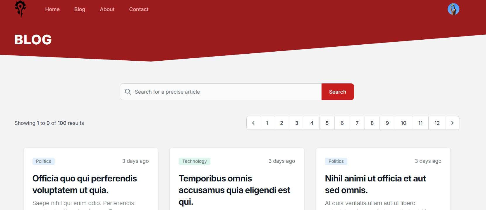

# Laravel Project of Victor LEQUEUX AUDRAN

<p align="center"><a href="https://laravel.com" target="_blank"></a></p>

Welcome to the Github repository of the Laravel project of Victor Lequeux Audran done for the course Framework Based Programmming at ITS !

**Please not that this project is based on the videos of "Web Programming UNPAS" accessible with the link https://youtube.com/playlist?list=PLFIM0718LjIW1Xb7cVj7LdAr32ATDQMdr&si=EnzDnAorEajXezoN**

## Use of Tailwind template and Blade component

In order to have a functional and clear Website, I used the PHP code of free pages templates in my views from the website Tailwind.

<p align="center">
    
</p>

And to avoid redundancy between my pages I used Blade Components to factorize my code for common elements like the navigation bar and the header   

<p align="center">
    
</p>

## Database 

My database is handled by Table plus and is using SQLite.

<p align="center">
    
    
</p>

To interact with  my database I am using Eloquent ORM models.  

<p align="center">
    
</p>

## Post factory

To automatically fill the "posts" table in my database, I created a new factory `PostFactory.php` using Laravel's integrated tool, Eloquent: Factories. 

<p align="center">
    
</p>

I wanted to personalize it so that the names of post's authors sounded french. The PHP library `Fake` allows us to do that by modifying the value of the `APP_FAKER_LOCALE`variable to `fr_FR` in the `.env` file. The results are a blog page filled with 100 posts randomly generated but with french authors :

<p align="center">
    
</p>

NOTE : don't forget to add `use Illuminate\Database\Eloquent\Factories\HasFactory;` and `use HasFactory;` in the `Post.php` file located at `app\Models` to inform Laravel that you are using a factory in this model. 

## Tables relationship

The next step was to add relationship between table : we want every article author to be a user. Here is how I did it : 

- Firstly we need to change our `PostFactory.php` so that the author is not a randomly assigned name but a user : `'author_id' => User::factory(),`. 

- Then we need to tell the database that a user can write many posts. For that we go in `User.php` and we add a method that will define the type of relationship between users and posts (in this case **one to many**) : 
```
public function posts(): HasMany{
        return $this->hasMany(Post::class,'author_id');
    }
```

- Now, we need the "inverse link" : which mean being able to access the author from an article. For that we go in `Post.php` and add the method : 
```
public function author(): BelongsTo{
        return $this->belongsTo(User::class);
    }
```

- Finally we modify our UI (the `post.blade.php` and `posts.blade.php` views and we also create a new route) so that when clicking on the author of an article, we can see all the articles that he wrote :

<p align="center">
    
</p>

NOTE : 
- The command in Tinker to create 5 users and generate 100 posts they created (the number of posts per user is random) is : `App\Models\Post::factory(100)->recycle(User::factory(5)->create())->create();` 

- I followed the same instructions to assign a category (Science, Economy, Politics,...) to each post. The functionality are the same : every new post will be assigned a category randomly and by clicking on the category of the post you can see all the posts in that category. To make it more appealing each category is displayed in a different color. 

<p align="center">
    
</p>

## Database seeder

To make my database testing even easier I created seeders. Their purpose is to automate the creation of fake datas without having to enter command in Tinker. Instead, when you do a fresh migration of you database you type the command : `php artisan migrate:fresh --seed` and it will fill the tables of your database based on what you wrote on the seeder files. Here are the steps to do this : 

- Enter the command `php artisan make:seeder` in the terminal, name them properly (here I chose `CategorySeeder.php` and `UserSeeder.php`)

- In the file tap the same command that you'd have entered in Tinker (without the path) for example if I want to create 6 users everytime I make a fresh migration I write : `User::factory(6)->create();`. I did this for my categories aswell.

- Then to seed the whole database, you go in `DatabaseSeeder.php` (same folder as the others : `\App\Database\seeders`) and you "call" the "sub-seeders" :   
```
$this->call([CategorySeeder::class,UserSeeder::class]);
Post::factory(100)->recycle([
    Category::all(),
    User::all(),
])->create();
```
**If your factories and models are properly set up it should fill your database automatically every fresh migration !**

## Solving the N+1 problem

The problem on my posts page is that the number of queries needed wasn't optimized : whenever I loaded the page the system was doing 205 queries to search for the posts infos. The reason is that at first the database was doing a `select*` of all posts but then, for each post the database was doing 2 queries : one to retrieve the author and one for the category. 

<p align="center">
    
</p>

This was not good and very slow. Fortunately Laravel has a feature called "eager loading" to solve this. All you need to do is add this line to your `Post.php` file : `protected $with = ['author','category'];` this will inform the system that it needs to only run one query to retrieve all the author from all the posts and one for all the categories. The result is that for 100 posts we no longer need 200+1 query (it's not a 2N+1 situation anymore).

<p align="center">
    
</p>

## Posts page UI redesign

The posts page was ugly so I redesigned it using a flowbite template (this is using the tools already installed with tailwind) :

<p align="center">
    
</p>

## New feature : searching a precise post

To implement this feature I needed to :

- Add a function called scopeFilter in my `Post.php` model : 
```
public function scopeFilter($query, array $filters){
    if ($filters['category'] ?? false) {
        $query->whereHas('category', function ($query) use ($filters) {
            $query->where('slug', $filters['category']);
        });
    }

    if ($filters['author'] ?? false) {
        $query->whereHas('author', function ($query) use ($filters) {
            $query->where('username', $filters['author']);
        });
    }

    if ($filters['search'] ?? false) {
        $query->where('title', 'like', '%' . $filters['search'] . '%');
    }
} 
```

- Then I had to modify my `/posts` route to inform it that if there was a search filter it needed to display only certain posts : 
```
Route::get('/posts', function () {
    $title = 'Blog'; // Default title

    // Check if there's a category filter in the request
    if (request('category')) {
        $category = Category::where('slug', request('category'))->first();
        if ($category) {
            $title = 'Category: ' . $category->name;
        }
    }

    // Check if there's an author filter in the request
    if (request('author')) {
        $author = User::where('username', request('author'))->first();
        if ($author) {
            $title = 'Posts by: ' . $author->name;
        }
    }

    // Check if there's a search filter in the request
    if (request('search')) {
        $title = 'Search results for: ' . request('search');
    }

    // Return the view with the dynamic title
    return view('posts', [
        'title' => $title,
        'posts' => Post::filter(request(['search', 'category', 'author']))->latest()->paginate(9)
    ]);
});
```

- Finally I added a search bar from Tailwind to my UI and set the href correctly like this : `href="/posts?category={{$post->category->slug}}"`

<p align="center">
    
</p>

## New feature : pagination

If there are a lot of posts and you want to display them on multiple pages you just need to add / change 2 things : 

- In your `web.php` file : in the return or your `/posts` route, change `latest()->get()` by `latest()->paginate(9)` (9 is the number of posts you want to display by page)

- In you `posts.blade.php` view : just add `{{$posts->links()}}` where you want you pagination bar. Laravel will do the rest !

<p align="center">
    
</p>

## Commits History

Please note that all commits before the one named **"Merge branch 'recovered work'" (Sep 19, 2024 - ID: c55d8411d7fe51dc48da76154c67618c94d596e8)** are not relevant, as I encountered issues setting up the repository. Therefore, I will start explaining my modifications from this commit onward.

### Key Commits:

- **Implementation of : seeders, queries optimization (n+1 problem), posts UI redesign, searching and pagination**  
  *Date: Oct 3, 2024 - ID : 39fee658d63df1a4889a1b54f870e7642e7c5175*  
  This commit adds many features like seeders, I also optimized the numbers of queries by solving the n+1 problem with eager loading, redesigned the posts' page UI and added pagination and the possibility to search for a precise post.

- **Relationship between tables Users Posts and Categories**  
  *Date: Sep 25, 2024 - ID : 7a09fd07ed448c8fc5c10e1f11808366889ede4b*  
  This commit adds relationship between tables so that we can use foreign key to access information on an author (or a topic) from the posts written by this user (or in this category).

- **Implementation of model factory to autogenerate posts**  
  *Date: Sep 24, 2024 - ID: 01add1a658af5ad8ab90aa33e5490b6396a84458*  
  This commit adds the possibility to autogenerate posts using the Model Factory features of Laravel.

- **No more 404 errors when clicking the navbar from a post**  
  *Date: Sep 19, 2024 - ID: 69b9bfcc2021056bc02b631c6ba6e535d5696d02*  
  This commit adds a `/` to all lines with an `href` going to another page in my `navbar.blade.php` component. It fixes the issue where clicking on a different page from a specific post resulted in a 404 error.

- **Test**  
  *Date: Sep 19, 2024 - ID: ef36231231839d6626220d073d4cbe16e27f094a*  
  This was a test commit to verify if my merge worked. I made a minor modification to this `README.md` file to ensure it was uploaded correctly to GitHub.

- **Merge branch 'recovered work'**  
  *Date: Sep 19, 2024 - ID: c55d8411d7fe51dc48da76154c67618c94d596e8*  
  After losing my work and recovering it, I was working on a detached head. This commit reattached my recovered work to the main branch.

